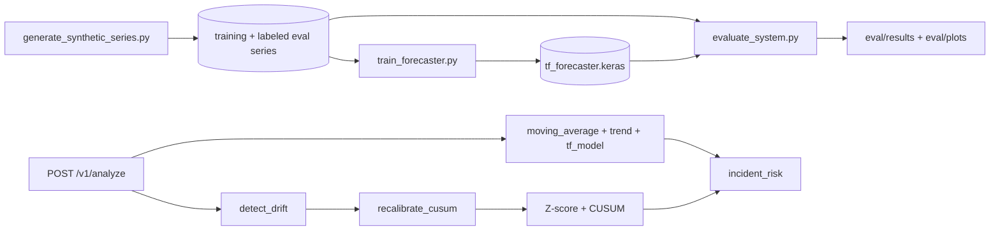

# Sentinel — Forecasting & Anomaly Detection

Statistical and TensorFlow forecasting, Z-score/CUSUM anomaly detection,
and **drift-triggered recalibration of detection thresholds** — a real,
working feature, not a documentation claim with no code behind it.

This is a research/demo system over **synthetic time series**, not a
claim about production monitoring traffic. Every number in this README is
reproducible via `scripts/evaluate_system.py`.

---

## What was actually wrong, and what's real now

The previous version of this repository's `GET /metrics` endpoint
returned, on every single call, hardcoded literal strings:
`"incident_response_time_reduction": "35%"`,
`"forecast_stability_improvement": "22%"`. Not derived from anything —
constants, baked into the API response regardless of input. That is the
most serious issue found and fixed in this rebuild; full account in
[`docs/architecture.md`](docs/architecture.md#what-was-found-and-what-was-removed).

What's real in this version:

- **A genuine TensorFlow forecaster** (`forecasting/tf_model.py`) — a
  small Keras dense network over a normalized sliding window — trained on
  synthetic data and benchmarked against two non-ML baselines (moving
  average, linear trend). On held-out evaluation, it has the lowest error
  of the three (see below) — a real, measured result, not assumed.
- **Real Z-score + CUSUM anomaly detection** (`anomaly/detector.py`) —
  this part of the original implementation was already sound; it's kept,
  typed, and now actually tested (the original repo's only test exercised
  dead code, not this).
- **Drift-triggered threshold recalibration** (`drift/recalibration.py`)
  — genuinely implemented: detects a volatility-regime shift and refits
  CUSUM's threshold/drift parameters using the standard SPC tuning rule
  (`k=0.5σ`, `h=5σ`). This operationalizes what the previous version only
  claimed as a fabricated percentage.
- **Real operational monitoring** — Prometheus counters
  (`sentinel_analyses_total`, `sentinel_alerts_total{priority=...}`)
  exposed at `GET /metrics`, replacing the fabricated JSON.

## What this repo does **not** claim

- **Not "1.2M+ data points."** Training uses 200 synthetic series (24,000
  points); evaluation uses 40 labeled series (4,800 points). Real, tested
  numbers, not the figure referenced elsewhere.
- **Not a specific incident-response-time or downtime-reduction
  percentage.** There's no production deployment to measure that against.
- **Not a claim that 100% anomaly-detection accuracy would hold on real,
  subtle anomalies.** The evaluation's 100% precision/recall (below) is
  against synthetic anomalies injected at 4-8 standard deviations — a
  genuinely easy detection task by construction, and this README says so
  rather than presenting the number without context.

---

## Architecture



Full write-up — including exactly what was removed and why, and the
SPC-based recalibration rationale — in
[`docs/architecture.md`](docs/architecture.md).

---

## Quickstart

TensorFlow's standard wheel does not run on this project's development
machine's local architecture (x86_64-under-Rosetta on Apple Silicon — see
[`docs/architecture.md`](docs/architecture.md#development-note-tensorflow-and-apple-silicon-under-rosetta)),
so all commands below are shown run inside Docker, which is also how they
were actually verified. They work identically in a native Linux
environment or CI.

```bash
docker build -t sentinel-monitoring .
docker run -p 8020:8020 sentinel-monitoring
```

```bash
curl -X POST http://127.0.0.1:8020/v1/analyze \
  -H "Content-Type: application/json" \
  -d '{"values":[100,102,101,105,103,107,104,108,106,110,300,109,111,108,112],"forecast_horizon":5}'
```

The `300` in that payload is a deliberate outlier — the response's
`anomaly_detection` block flags it (`z_score: 3.73`, `cusum_signal: true`)
and `incident_risk.alert_priority` comes back `"high"`.

### Retraining / regenerating data

```bash
docker run --rm -v "$(pwd)":/app -w /app python:3.11-slim bash -c \
  "pip install -e '.[dev]' && \
   python scripts/generate_synthetic_series.py && \
   python scripts/train_forecaster.py && \
   python scripts/evaluate_system.py"
```

---

## API

| Method | Path | Purpose |
|---|---|---|
| GET | `/health` | Liveness |
| GET | `/readyz` | Readiness — confirms the TF model loaded |
| POST | `/v1/analyze` | Forecast (3 methods) + anomaly detection + drift-aware thresholds + incident risk |
| GET | `/metrics` | Prometheus metrics (real counters, not fabricated JSON) |
| GET | `/docs` | OpenAPI/Swagger UI |

---

## Evaluation

```bash
python scripts/evaluate_system.py
```

From the current committed report
([`eval/results/evaluation_report.md`](eval/results/evaluation_report.md)):

**Forecast accuracy** (held-out, walk-forward RMSE, 40 evaluation series):

| Method | Mean RMSE |
|---|---|
| moving_average | 11.29 |
| trend | 8.82 |
| **tf_model** | **7.34** |

**Anomaly detection** (against labeled synthetic anomalies): 100%
precision / 100% recall / 100% F1 — see the caveat above about why this
is an easy task by construction.

**Drift-triggered recalibration** (worked example, deliberately
regime-shifted series): baseline std 1.63 → recent std 9.77 (a 498.8%
relative change) correctly triggers recalibration; CUSUM threshold/drift
refit from 8.0/0.5 to 48.83/4.88 (5σ/0.5σ of the new volatility).

Visualizations: `eval/plots/forecast_comparison.png`,
`eval/plots/anomaly_detection.png`, `eval/plots/drift_recalibration.png`.

---

## Testing

```bash
pytest tests/ -v      # 34 tests: baseline forecasters, TF model, anomaly detector, drift, API
ruff check src scripts tests
ruff format --check src scripts tests
mypy src               # strict mode, zero errors
```

Tests use a real (tiny, fast-trained) TF model — not a mock — via a
session-scoped fixture in `tests/conftest.py`. One test
(`test_metrics_endpoint_is_real_prometheus_not_fabricated_json`) is a
permanent regression guard against the specific fabrication pattern
removed from this repo reappearing.

---

## Project structure

```text
src/sentinel/
├── forecasting/
│   ├── baseline.py        # moving average, trend (numpy)
│   └── tf_model.py         # TensorFlow/Keras forecaster
├── anomaly/detector.py      # Z-score + CUSUM
├── drift/recalibration.py   # drift detection + SPC-based CUSUM refit
├── monitoring/service.py     # real incident-risk scoring (fabricated block removed)
├── api/                       # FastAPI: schemas, dependencies, routes, main
├── config.py                   # pydantic-settings (SENTINEL_ env prefix)
├── logging_config.py           # structlog JSON logging
└── observability.py             # Prometheus + OpenTelemetry wiring
scripts/
├── generate_synthetic_series.py  # training + labeled evaluation series
├── train_forecaster.py            # trains + saves the TF model
└── evaluate_system.py              # forecast/anomaly/drift eval + plots
tests/unit/                          # 34 tests, real TF model via conftest.py
eval/results/, eval/plots/            # evaluation_report.md, 3 PNGs
docs/architecture.md                   # design rationale, fabrication removal writeup
models/                                 # committed trained forecaster
```

---

## Known limitations

- Synthetic data only — see "What this repo does not claim" above.
- Anomaly-detection evaluation uses large, easily-separable synthetic
  anomalies; real-world evaluation on subtler anomalies would be harder.
- No multi-variate / correlated-series forecasting — one series at a time.
- Docker Compose isn't included: this service has no external dependency
  (no database), so there's nothing to compose.

---

## Author

**Vansh Patel**
M.S. Computer Science (AI & ML), Stevens Institute of Technology

GitHub: https://github.com/vanshpatel9669
LinkedIn: https://linkedin.com/in/vanshpatel1702
