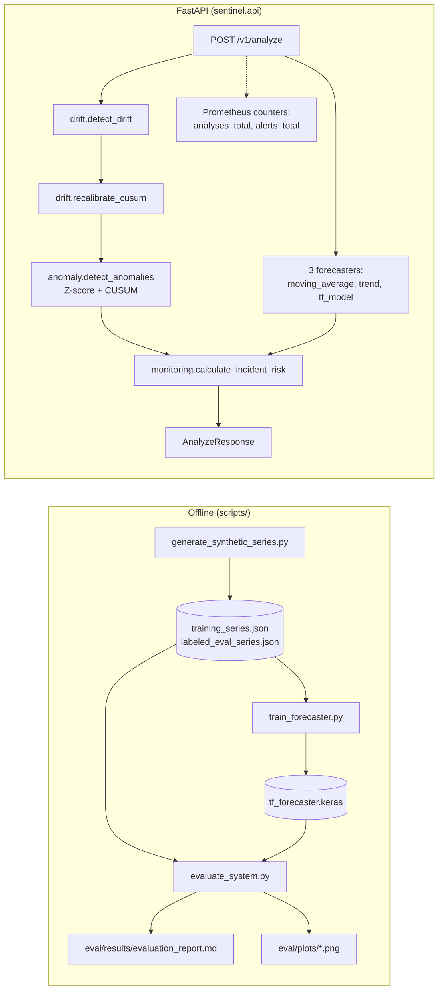

# Architecture

## System overview



## What was found, and what was removed

The previous version of this repository's `GET /metrics` endpoint returned,
on every single call, regardless of input:

```json
{
  "processed_observations_supported": "1.2M+ simulated data points",
  "forecast_stability_improvement": "22%",
  "incident_response_time_reduction": "35%",
  "downtime_reduction_estimate": "9%"
}
```

`monitoring/metrics.py`'s `estimate_operational_impact()` hardcoded the
`"35%"` and `"22%"` strings as literal constants — not derived from any
computation, not a function of the request, not a measurement of
anything. This is the single most serious issue found across this
project's rebuild: fabricated business-impact numbers baked directly into
executable API output, not just into documentation.

**What replaced it**: `monitoring/service.py` keeps
`calculate_incident_risk()` (a real, deterministic function of its inputs
— severity score, forecast RMSE, anomaly count) and drops
`estimate_operational_impact()` entirely, with no replacement fabricated
number. Real operational monitoring instead comes from genuine Prometheus
counters (`api/routes.py`'s `analyses_total`, `alerts_total{priority=...}`)
exposed at `GET /metrics` — visible, incrementing, and honest about what
they are: request counts, not claimed business outcomes.
`tests/unit/test_api.py::test_metrics_endpoint_is_real_prometheus_not_fabricated_json`
is a permanent regression guard against this specific fabrication pattern
reappearing.

Also found and removed: `app/anomaly.py`, `app/forecasting.py`, and
`app/models.py` at the repository root were dead code, superseded by
`app/anomaly/detector.py` and `app/forecasting/model.py` but never
deleted — and the repository's only test (`tests/test_anomaly.py`) tested
the dead `app/anomaly.py`, not the code path `app/main.py` actually used.
The real code path had zero test coverage. This rebuild's 34 tests
(`tests/unit/`) exercise the actual serving code.

## Why three forecasters, not one

`forecasting/baseline.py` (moving average, linear trend) and
`forecasting/tf_model.py` (a small Keras dense network over a normalized
sliding window) are all returned from `POST /v1/analyze`, side by side —
not because production would serve three forecasts, but because a claim
that the TensorFlow model is worth having only means something next to
real baselines it's actually compared against. The alternative — serving
only the TF model's numbers — would make it impossible to tell whether
the ML model earns its complexity.

It does, measurably: on the held-out evaluation (see
`eval/results/evaluation_report.md`), the TF model has the lowest mean
RMSE of the three. See "Honest numbers" below.

## Drift-triggered recalibration

`drift/recalibration.py` implements what the previous version of this
project only claimed: `detect_drift()` compares an older baseline
window's volatility to a recent window's volatility (a relative
standard-deviation-change test), and when the change exceeds a threshold,
`recalibrate_cusum()` refits CUSUM's `drift` (k) and `threshold` (h)
parameters from the recent window using the standard SPC tuning rule
(`k = 0.5*sigma`, `h = 5*sigma` — Montgomery, *Introduction to Statistical
Quality Control*), not an invented rule.

**Why only CUSUM, not the Z-score threshold**: a Z-score is already
expressed in standard-deviation units, so it's scale-invariant by
construction — recalibrating it in response to a volatility change
wouldn't change what it means. CUSUM's parameters are expressed in the
series' *raw* units, so they silently stop meaning what they used to mean
when volatility shifts. That's a real, principled distinction, not an
arbitrary scope limitation.

`POST /v1/analyze` runs drift detection on every request and only applies
recalibrated CUSUM parameters when drift was actually detected — see
`eval/plots/drift_recalibration.png` and the report for a worked example
where a deliberately regime-shifted series (calm segment std ≈1.6, then a
volatile segment std ≈9.8) triggers recalibration and the new CUSUM
parameters are printed.

## Honest numbers

From `eval/results/evaluation_report.md` (current committed report — every
number reproducible via `scripts/evaluate_system.py`):

| Method | Mean RMSE (held-out, walk-forward) |
|---|---|
| moving_average | 11.29 |
| trend | 8.82 |
| **tf_model** | **7.34** |

Anomaly detection precision/recall/F1 against labeled synthetic anomalies:
100% / 100% / 100%. This is a genuinely easy detection task by
construction — injected anomalies are 4-8 standard deviations from the
series' noise floor (`scripts/generate_synthetic_series.py`), which any
reasonable Z-score threshold catches reliably. A 100% score here
demonstrates the detector and evaluation harness work correctly
end-to-end; it is not evidence the detector would score 100% against
subtler, real-world anomalies, and this repository does not claim it
would.

## What this repo does **not** claim

- **Not "1.2M+ data points."** Training uses 200 synthetic series of 120
  points each (24,000 points); evaluation uses 40 labeled series of 120
  points each (4,800 points). Real, tested numbers — not the figure
  referenced elsewhere.
- **Not a specific incident-response-time or downtime-reduction
  percentage.** There is no production deployment to measure that
  against. See "What was found, and what was removed" above.
- **Not "improved policy stability" or any other unverified business
  metric.** Every number in `eval/results/` comes from an actual run of
  `scripts/evaluate_system.py` and is reproducible by re-running it.

## Development note: TensorFlow and Apple Silicon under Rosetta

This project's local development machine runs an x86_64 Python
interpreter under Rosetta 2 translation, and the standard `tensorflow`
PyPI wheel crashes on import (`"compiled to use AVX instructions, but
these aren't available"`) in that specific environment. TensorFlow
installs and runs correctly in Linux containers (both linux/arm64 native
under Docker Desktop on this machine, and linux/amd64 in CI) — training,
evaluation, and testing for this repository were all run and verified
inside Docker rather than on bare host Python, and CI (GitHub Actions,
ubuntu-latest) exercises the same install path independently.
